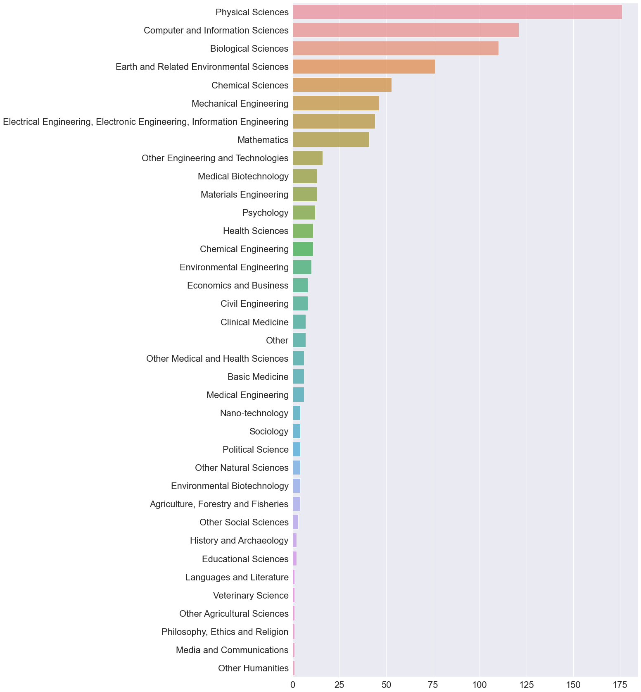
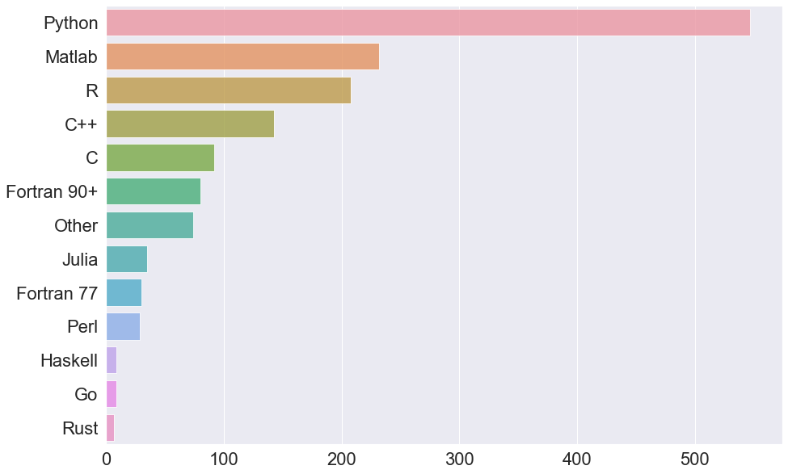
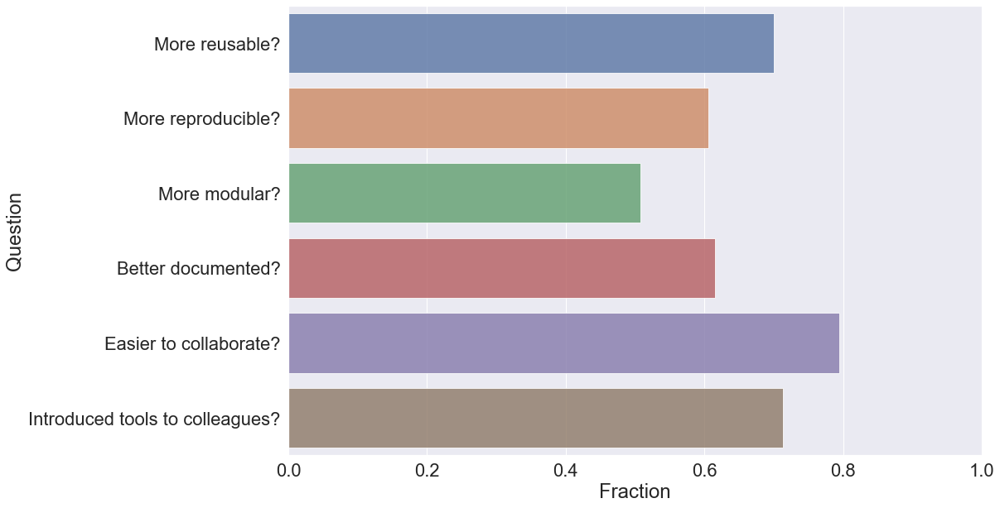
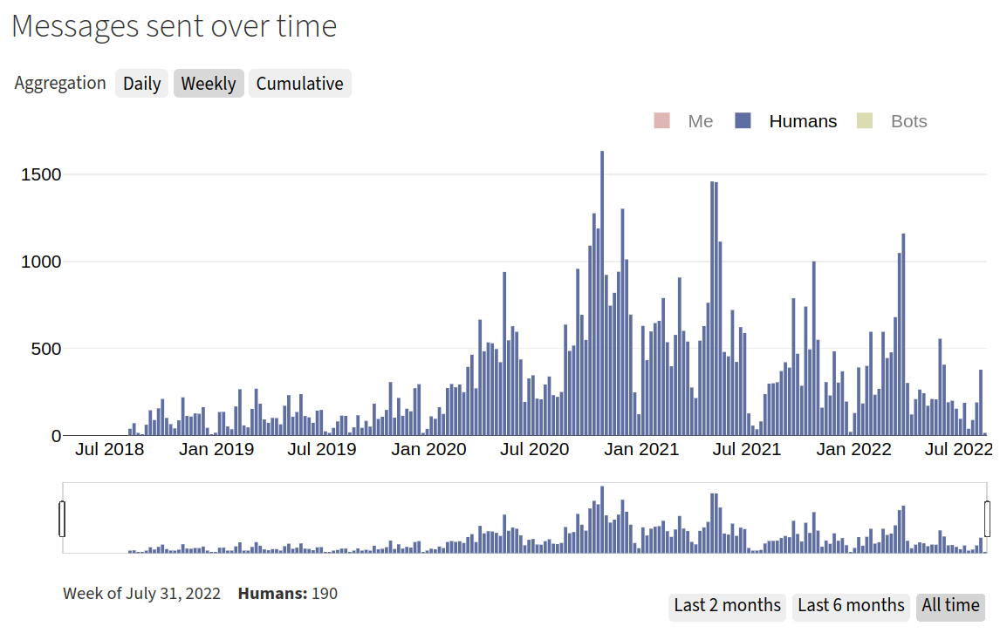

# Abstract

This report summarizes the achievements of the CodeRefinery project phase 2
(October 2018 - October 2021), and documents experiences and recommendations
for improvements in the working methods of future projects.

The project operated with a budget of 3 FTE distributed over 5 partners:
NeIC, Sigma2, SNIC, DeiC, and CSC.

The report is drawn-up in agreement between NeIC as the project owner
represented by Tomasz Malkiewicz and the project manager Radovan Bast.

# Background and goals {#sec-background}

## Background

CodeRefinery acts as a hub for FAIR (Findable, Accessible, Interoperable, and
Reusable) software practises. It currently focuses on the Nordic/Baltic
countries, but aims to expand beyond this region. CodeRefinery aims to operate
as a community project with support from academic organisations. The project
started in 2016 and has developed a broad curriculum of openly maintained and
reviewed lessons, has taught hundreds of participants across all academic
disciplines, and has managed to build a community of instructors, learners,
helpers, exercise leads (who help learners during exercises), expert helpers
(who support exercise leads), and partner organisations.

## History of the project

The project idea/directive grew out of two courses given at PDC/KTH in 2014
and 2015, which focused on research software engineering tools and techniques.

The courses were popular and it was clear that the demand is not limited to
the Stockholm region and we approached NeIC to bring this project to a Nordic
level, both to have more impact, but also to connect instructors across Nordic
borders.

The first CodeRefinery workshop was given late 2016 and since then the lesson
material has evolved a lot and we have delivered many more workshops, both
in-person and online.

## Objectives

The objectives of this project were:

- Organize and deliver workshops and events
- Develop and maintain a lesson portfolio
- Build a community and network of instructors and volunteer helpers
- Operate a Nordic GitLab service
- Coordinate Carpentries workshops and community in the Nordics/Baltics
- Support the community of Nordic research software engineers

## Documents and project reports

- [Project directive (phase 1)](https://coderefinery.org/about/reports/phase-1-project-directive.pdf)
- [Collaboration agreement (phase 1)](https://coderefinery.org/about/reports/phase-1-collaboration-agreement.pdf)
- [Project plan (phase 1)](https://coderefinery.org/about/reports/phase-1-project-plan-v1.0.pdf)
- [Report (phase 1)](https://coderefinery.org/about/reports/phase-1-report.pdf)
- [Project directive (phase 2)](https://coderefinery.org/about/reports/phase-2-project-directive.pdf)
- [Collaboration agreement (phase 2)](https://coderefinery.org/about/reports/phase-2-collaboration-agreement.pdf)
- [Project plan (phase 2)](https://coderefinery.org/about/reports/phase-2-project-plan.pdf)
- [Mid-term report (phase 2)](https://coderefinery.org/about/reports/phase-2-mid-term-report.pdf)
- [Mid-term presentation (phase 2)](https://coderefinery.org/about/reports/https://cicero.xyz/v3/remark/0.14.0/github.com/coderefinery/reports/main/mid-term.md/)
- [Proposal to the NeIC open call 2021](https://coderefinery.org/about/reports/open-call-2021-proposal.pdf)
- [NeIC open call 2021 evaluation report](https://coderefinery.org/about/reports/open-call-2021-evaluation.pdf)
- [Collaboration agreement (phase 3)](https://coderefinery.org/about/reports/phase-3-collaboration-agreement.pdf)

# Results

## Training events

Our past events and participation statistics are summarized on the web:

- <https://coderefinery.org/workshops/past/>
- <https://coderefinery.org/about/statistics/>

During this phase of the project we have delivered:

- 18 workshops to 800 participants
- 3 instructor training events to 67 participants
- 21 shorter workshops and other events to 650 participants

Over 30 instructors/speakers and over 100 helpers and exercise leads have helped to make
this happen^[For more details please see
<https://coderefinery.org/organization/contributors/>].

## Lesson material and video recordings

The project has developed a broad curriculum of lessons and manuals:

- For individuals and small groups
  - [Introduction to version control](https://coderefinery.github.io/git-intro/)
  - [Collaborating and sharing using GitHub without command line](https://coderefinery.github.io/github-without-command-line/)
  - [Jupyter notebooks](https://coderefinery.github.io/jupyter/)
  - [Automated testing](https://coderefinery.github.io/testing/)
  - [Modular code development](http://cicero.xyz/v3/remark/0.14.0/github.com/coderefinery/modular-code-development/master/talk.md)
  - [Modular code development type-along](https://coderefinery.github.io/modular-type-along/)

- For research groups and collaborations
  - [Collaborative distributed version control](https://coderefinery.github.io/git-collaborative/)
  - [Git branch design](https://coderefinery.github.io/git-branch-design/)
  - [Documentation](https://coderefinery.github.io/documentation/)

- For the community
  - [Social coding and open software](https://coderefinery.github.io/social-coding/)
  - [Reproducible research](https://coderefinery.github.io/reproducible-research/)

- Instructor training and manuals
  - [Instructor training](https://coderefinery.github.io/instructor-training/)
  - [CodeRefinery manuals, our guides and hints on running CodeRefinery](https://coderefinery.github.io/manuals/)

- Installation guides
  - [Installation instructions](https://coderefinery.github.io/installation/) (see your workshop page for which ones are actually needed for you)

- Special topics
  - [CMake workshop (based on ENCCS version)](https://coderefinery.github.io/cmake-workshop/)
  - [Mixed Martial Arts: Interfacing Fortran, C, C++, and Python](https://coderefinery.github.io/mma/)
  - [Data visualization using Python](https://coderefinery.github.io/data-visualization-python/)

The lessons and manuals are maintained on
[GitHub](https://github.com/coderefinery) and are all open-source, licensed
under the [Creative Commons Attribution license
(CC-BY)](https://creativecommons.org/licenses/by/4.0/).

A number of video recordings of CodeRefinery lessons and workshops and
[Research Software Hour](https://researchsoftwarehour.github.io/) sessions can be
found on our [YouTube
channel](https://www.youtube.com/channel/UC47aupE7HKGduAjXKt1Gwrg/videos).

## Transition to online teaching

The CodeRefinery project managed to grow and expand scale and reach during the
pandemic. The project team has reacted very quickly to the restrictions related
to COVID-19 and we have transitioned to online teaching within weeks and
delivered our first online training event on April 7 and 8. We have used this
as an opportunity to reach a wider audience and by the end of May we were able
to deliver an online training event to over 100 participants, with live
streaming the event and recording the sessions. Transitioning to online
teaching has enabled us to on-board many more new and future instructors and
volunteer instructors and helpers compared to earlier years, in particular from
Aalto Scientific Computing group. We have found it very beneficial to allow
teams to register and participate in a training event ("bring your own breakout
room"). Our lessons learned are documented in two blog posts (see references).

## Pre- and post-workshop survey results

Participants of CodeRefinery workshops were asked to fill a pre-workshop survey
before attending the workshop. In this survey we collect information on
previous experience with various tools and programming practices.  The data and
plots can be found in <https://github.com/coderefinery/pre-workshop-survey>.

We also sent out a survey to all participants of CodeRefinery workshops around
3-6 months after the workshop has taken place.  The data and plots can be found
in <https://github.com/coderefinery/post-workshop-survey>.

In @fig-discipline to @fig-heatmap we summarize the most interesting results.

{#fig-discipline}

{#fig-heatmap}

## Carpentries membership: workshops and instructor training

NeIC held a 3-year Carpentries Platinum membership until Nov 1, 2021. Major
membership benefits were 15 seats for Carpentries instructor training per year
and 6 centrally organized Carpentries workshops per year without coordination
fee. Since November 2019, N. Tatara has been acting as Carpentries Regional
Coordinator in the Nordic countries and has significantly increased the
visibility of Carpentries activities within the Nordics and visibility of
CodeRefinery and NeIC within the Carpentries community.

The uptake of the instructor training was good. However, centrally organized
workshops turned out to be generally underused, and opportunities for online
Carpentries workshops should be more widely disseminated.

We have presented our lessons learned from online workshops of increasing scale
online workshops to the Carpentries in a blog post (["Lessons Learned from
Running Code Refinery's First Online
Workshop"](https://carpentries.org/blog/2020/04/coderefinery-first-online-workshop/))
and a conference presentation ([Online workshops - How to scale up your online
workshop to reach 100
learners?](https://2020.carpentrycon.org/schedule/#session-32)) at
[CarpentryCon2020@Home](https://2020.carpentrycon.org/).

## GitLab code repository hosting

Since 2017 we operate a [GitLab code repository server for Nordic research
software](https://coderefinery.org/repository/).

This service has over 300 active users, 175 groups, with over 400 active projects.

Notable projects:

- ARC/NT1
- Earth Observation Laboratory
- Centre for Integrated Remote Sensing and Forecasting for Arctic Operations
- Symbioses
- Nordic Language Processing Laboratory
- EISCAT
- UiT Master of Applied Computer Science
- UiT Narvik R&D - Umbrella

## Nordic research software engineers

A number of CodeRefinery members are involved in [Nordic
research software engineers (RSE)](https://nordic-rse.org/) community building.

We have helped organizing the [Nordic-RSE get-together online event, Nov 30 -
Dec 2, 2020](https://nordic-rse.org/events/2020-online-get-together/) (106 registrations) and the
[Nordic-RSE Unconference, June 29 - 30,
2021](https://nordic-rse.org/events/2021-online-unconference/) (69 registrations).

## Research Software Hour

Richard Darst, Anne Fouilloux, and Radovan Bast streamed [25 live
shows](https://researchsoftwarehour.github.io/) about scientific computing and
research software.

## Twitter, newsletter, and chat

The project has 757 followers on Twitter, 213 subscribers to the CodeRefinery
newsletter and 333 users on the team chat. In 2020, with the shift to more
online work, we have observed a significant increase in messages exchanged
(@fig-chat-stats).

{#fig-chat-stats}

## Presentations

- [CodeRefinery and the Nordic perspective, at RDA FAIR webinar, Aug 30, 2021 (Radovan Bast)](https://rda-software-webinar.readthedocs.io/)
- [Plenary session at Seminar for bibliotekenes nettverk for ph.d.-støtte (Naoe Tatara)](https://www.phdontrack.net/nettverk/seminar/2021/program_final.pdf) -
Oppskalering av workshops på best praksis av data science og forskningsprogramvareutvikling - hvordan kan de nå de som trenger? [Presentation slides (Contents
except for the title is in English)](https://www.phdontrack.net/nettverk/seminar/2021/tatara.pdf)
- [Panel session at CarpentryCon 2020, (Naoe Tatara, Radovan Bast, Richard Darst, Anne Fouilloux, Petri Jehkonen, Matúš Kalaš, Samantha Wittke)](https://2020.c
arpentrycon.org/schedule/#session-32) - Mega CodeRefinery online workshop - How to scale up online workshop to reach 100 learners? [Presentation slides](https:
//cicero.xyz/v3/remark/0.14.0/github.com/coderefinery/carpentrycon-2020/master/slides.md/), [YouTube video of the session](https://www.youtube.com/watch?v=r-5R
sQqNInY)
- [Lightning talk at CarpentryCon 2020, (Sabry Razick)](https://2020.carpentrycon.org/schedule/) -
  [Carpentries next level - CodeRefinery model](https://sabryr.github.io/HPC-Carpentry-talk/)
- [Lightning talk at CarpentryConnect 2019, Manchester (Radovan Bast)](https://software.ac.uk/ccmcr19/programme/posters-lightning-talks)
- ["Coding like it's 1969", Toulouse, April 2019 (Radovan Bast)](https://cicero.xyz/v3/remark/0.14.0/github.com/bast/talk-coding-like-1969/master/talk.md/)
- [Albanova seminar, Stockholm, April 2019 (Thor Wikfeldt)](http://cicero.xyz/v2/remark/github/wikfeldt/longtalk-coderefinery/master/talk.md/)
- [Short talk at the CarpentryCon 2018 conference, Dublin (Thor Wikfeldt)](http://cicero.xyz/v2/remark/github/wikfeldt/shorttalk-coderefinery/master/talk.md/)
- [Nov 21-22, 2017, Narvik (Radovan Bast)](http://cicero.xyz/v2/remark/github/coderefinery/talk-intro/narvik-2017/talk.md/)
- [DeiC conference 2017, Kolding (Radovan Bast)](http://cicero.xyz/v2/remark/github/coderefinery/talk-intro/deic-2017/talk.md/)
- [Mid-term report presentation, NeIC Board meeting Sep 21, 2017, Copenhagen (Radovan Bast)](https://cicero.xyz/v3/remark/0.14.0/github.com/coderefinery/report
s/main/mid-term.md/)
- [NORDUnet workshop, Sep 12-15, 2017, Copenhagen (Jyry Suvilehto)](http://cicero.xyz/v2/remark/github/coderefinery/talk-intro/ntw-2017/talk.md/)
- [NorduGrid conference 2017, Tromsø (Radovan Bast)](http://cicero.xyz/v2/remark/github/coderefinery/talk-intro/nordugrid-2017/talk.md/)
- [NeIC conference 2017, Umeå (Radovan Bast)](http://cicero.xyz/v2/remark/github/coderefinery/talk-intro/neic-2017/talk.md/)
- [CodeRefinery day in Oslo, Apr 6, 2017 (Radovan Bast)](http://cicero.xyz/v2/remark/github/coderefinery/talk-intro/oslo-2017/talk.md/)
- [Sigma2 Metacenter meeting 2017, Tromsø (Radovan Bast)](http://cicero.xyz/v2/remark/github/coderefinery/talk-intro/sigma2-2017/talk.md/)
- [Workshop on Nordic Big Biomedical Data for Action 2016, Stockholm (Radovan Bast)](http://cicero.xyz/v2/remark/github/coderefinery/talk-intro/niasc-2016/talk
.md/)
- [SNIC User Forum 2016, Lund (Radovan Bast)](http://cicero.xyz/v2/remark/github/coderefinery/talk-intro/snic-2016/talk.md/)
- [NORDUnet conference 2016, Helsinki (Radovan Bast)](https://events.nordu.net/display/NDN2016/Welcome)
- DIRAC meeting 2016, Odense (Radovan Bast)
- Dalton meeting 2016, Uppsala (Radovan Bast)

## Articles about CodeRefinery

- [CodeRefinery workshop: Nettkurs for utviklere av forskningsprogramvare](https://www.usit.uio.no/om/organisasjon/itf/ds/task/task-bloggen/coderefinery-worksh
op.html)
- [CodeRefinery: En samfunnsbasert plattform for samkjøring av kurs og opplæring relatert til utvikling av forskningsprogramvarer](https://www.usit.uio.no/om/o
rganisasjon/itf/ds/task/task-bloggen/coderefinery-samfunn.html)
- *Better Science Through Better Software*, <https://neic.no/news/2020/06/29/better-science-through-better-software/>
- *A FAIRer future*, [Nature Physics 15, 728–730 (2019)](https://doi.org/10.1038/s41567-019-0624-3)
- *Bättre datahantering gör forskning mer reproducerbar*, [article in the Curie newsletter](https://www.tidningencurie.se/nyheter/2019/04/23/battre-datahanteri
ng-gor-forskning-mer-reproducerbar/) from the Swedish Research Council
- *CodeRefinery 2.0*, [PDC December 2018 newsletter](https://www.pdc.kth.se/publications/pdc-newsletter-articles/2018-no-2/coderefinery-2-0-1.864580) and [Tita
n.uio.no blog post](https://titan.uio.no/node/3162)
- *Teaching researchers to write better code*, [https://www.inthefieldstories.net/teaching-researchers-to-write-better-code/](https://www.inthefieldstories.net
/teaching-researchers-to-write-better-code/)
- *Better software leads to better science*, [NeIC news article](https://neic.no/news/2017/03/15/better-software-leads-to-better-science/)
- *First Year of CodeRefinery*, [PDC December 2017 newsletter](https://www.pdc.kth.se/publications/pdc-newsletter-articles/2017-no-2/first-year-of-coderefinery
-1.783468)
- *CodeRefinery and the Red Queen's race*, [CSC June 2017 blog post](https://www.csc.fi/web/blog/post/-/blogs/coderefinery-and-the-red-queen-s-race)
- *CodeRefinery Workshops*, [PDC June 2017 newsletter](https://www.pdc.kth.se/publications/pdc-newsletter-articles/2017-no-1/coderefinery-workshops-1.744807)
- *The CodeRefinery Project*, [PDC December 2016 newsletter](https://www.pdc.kth.se/publications/pdc-newsletter-articles/2016-no-2/the-coderefinery-project-1.7
44952)

## Blog posts

- [Outcomes from online hackathon about measuring the impact of CodeRefinery workshops (2022-05-18)](https://coderefinery.org/blog/2022/05/18/measuring-impact/)
- [Our plans to improve our workshop registration process (2022-05-04)](https://coderefinery.org/blog/2022/05/04/improving-workshop-registration/)
- [Lessons learned from the May 2021 online workshop (2021-11-25)](https://coderefinery.org/blog/2021/11/25/lessons-learned-may-2021/)
- [Towards citable lessons (2021-11-21)](https://coderefinery.org/blog/2021/11/21/towards-citable-lessons/)
- [Lessons learned from phase 2 of the project (2021-11-20)](https://coderefinery.org/blog/2021/11/20/phase-2-lessons-learned/)
- [Bi-weekly Community Calls started (2021-09-01)](https://coderefinery.org/blog/2021/09/01/bi-weekly-community-calls/)
- [Community discussion in Nordic and Baltic countries (2020-11-13)](https://coderefinery.org/blog/2020/11/13/carpentry-community-discussion-nordic/)
- [git-pr: painless small pull requests (2020-09-29)](https://coderefinery.org/blog/2020/09/29/git-pr/)
- [Report from the Mega-Coderefinery workshop (2020-07-31)](https://coderefinery.org/blog/2020/07/31/mega-coderefinery/)
- [CodeRefinery tools in action: NordicHPC (2020-04-27)](https://coderefinery.org/blog/2020/04/27/nordichpc-tools/)
- [Announcing the first Nordic-RSE conference (2020-04-24)](https://coderefinery.org/blog/2020/04/24/nordic-rse-conference/)
- [CodeRefinery workshops moving online (2020-04-24)](https://coderefinery.org/blog/2020/04/24/online-workshops-update/)
- [Rebase vs merge (2020-04-24)](https://coderefinery.org/blog/2020/04/24/rebase-vs-merge/)
- [Research Software Hour (2020-04-24)](https://coderefinery.org/blog/2020/04/24/rsh/)
- [Lessons learned from running our first online workshop (2020-04-14)](https://coderefinery.org/blog/2020/04/14/first-online-workshop/)

# Collected experiences and recommendations

In this section we collect and summarize lessons learned from phase 2 of our
project, both for our own future work but also for other future projects who
may find our experiences useful. We have chosen to collect the lessons learned
in bullet-point format and not in prose.

These lessons learned have been also published in form of a blog post^["Lessons
learned from phase 2 of the project", Radovan Bast, Richard Darst, Naoe Tatara,
<https://coderefinery.org/blog/2021/11/20/phase-2-lessons-learned/> (2021).].

Below we list experiences and also unsolved challenges from workshop
organization, lesson development, meeting minutes and decision tracking,
Carpentries membership, communication, data management, stakeholder- and
community engagement, and infrastructure hosting.

## Workshop/event organization

### Metrics

- When we started teaching in 2016, we only worried about the teaching and not
  about measuring how many participants from which country and from which
  discipline and career stage. However, we were asked to report about metrics
  again and again, on short notice. At some point we started reporting this in
  detail (<https://coderefinery.org/about/statistics/>) which really simplified
  reporting.

### Survey

- Survey should be designed considering analysis and presentation of results,
  as well as and what to focus on (what we want to present).
- When survey platform needs to be migrated to another, consider the structure
  of the questions and answers to avoid tedious post-processing. Over the past
  few years we have moved between platforms and also kept adapting questions
  which made the analysis non-trivial.
- How to get a better and precise overview of "actual" participants:
    - Both pre-/post-workshop surveys are opt-in, and they should be. In principle, sign-up form should collect only very necessary information for those to be able to participate in the workshop, and thus it may not be optimal to collect learner-profile type of information via sign-up form (at least not as mandatory fields), except for cases where we need to apply priority criteria or treating participants differently (e.g. team participation, grouping according to background so that they can work on different exercises etc.)
    - Pre-workshop survey: so far submitted by anyone voluntarily upon sign-up. Not necessarily all the submitters are participating in the workshop, neither all the actual participants submitted the pre-workshop survey. It might be an idea to ask them to submit upon acceptance to increase accuracy to some extent.
    - Post-workshop survey:
        - It needs a scheduled reminder to the organizer side have consistency in the time between the workshop and the survey timing, as the survey aims to see the long-term effect of the workshop.
        - There is inevitable risks that the survey invitation cannot reach the email address registered after a half year or such, and of course we cannot expect very high response rate, either.
        - Another limitation that we need to think of could be that the chances might be higher for those who had positive impression would submit the post-workshop survey than those who had negative impression, which will naturally yield biased results.

### Capacity and workshop format

- How to afford as many as possible learners while keeping good learner experiences
  or even improving them.
- How we carried out online workshops in 2020-2021:
     - Standard 3-full day CR workshop was transformed into 6-half day format, typically Tuesday-Thursday over 2 consecutive weeks.
     - Helper/Exercise lead on-boarding sessions as well as installation help drop-in sessions were held typically a week before the 1st week.
     - All the exercises were done in breakout room with a group of regular members.
     - We recruited exercise leads and accepted 5-6 individual learners per exercise lead plus team registration including their own exercise lead.
     - We used priority criteria based on countries and/or institution's characteristics.
     - Problems/challenges we experienced:
         - Withdrawals on short notices and no-shows
         - Significant effort to prepare and adjust exercise groups and adapt to cancellations and last-minute changes
         - Feedback showing both positive and negative experiences with regular members/exercise leads
- What is the optimal format of help provision and exercises:
    - Should the group members be fixed or more ad-hoc or even hop-in-and-out?
    - Is one regular exercise lead always needed per group? One disadvantage of not-having regular exercise lead is that it takes time to call help, explaining situation etc., which eats up exercise time.
    - "Webinar (stream)-by default" with an option for joining in zoom-meeting room for extra help may work better (ref. [Python for SciComp 2021](https://scicomp.aalto.fi/training/scip/python-for-scicomp/))?
    - Post-workshop Q&A session time/day would be useful?
    - We have considered for the future to offer optional exercise walk-through sessions. These could be
      interesting not only for learners but recording of these sessions could also help future
      exercise leads.

### Communication with participants

- Indico's email function worked well to send information about the workshop to participants/signers.
- We experienced few cases of typo in email address, which made it more difficult to reach registrants.
- Online collaborative notebook (HackMD and similar) worked well for Q&A during the lectures.

### Certificates

- Should CR issue any certificate at all? Certificates became participation certificates and possibly we should delegate certification to participating organizations.
- ["TU Delft PhD candidates can obtain 2 GS credits (Research skills) when attending and actively participating in the workshop (complete assistance)"](https://www.tudelft.nl/en/library/research-data-management/r/training-events/training-for-researchers/code-refinery-workshop) - It may be better that each institute would have one responsible for approval of students' (or similar) active participation in any of the CR workshops as part of the study etc rather than CR takes responsibility on their participation by checking their records in Zoom etc.
- (Relevant to [Legal questions](#Legal-questions)) Issuing certificates may have some problems with data management including personal information.

### Planning

- Long term scheduling with fixed twice-per-year schedule is probably better than juggling many calendars and trying to find a time slot 1 month in advance.
- Planning relevant workshops/events before and after the CR big workshops will be also helpful. They include for example Software Carpentry, Python for SciComp, Hackathon, etc.

## Lesson development

- Only happened before workshops. This was very efficient but introduced stress. Our ambition for the future is to organize
  retreats or hackathons where we can work on lesson development with more focus and less time pressure.
- It probably requires a calendar event to dedicate time for this.
- "software installation and setup"
    - This is not lesson itself, but this also needs to be updated along the lesson development and improvement as well as along the changes implemented in different software programs, packages and platforms to use (e.g. GitHub).
    - The procedures need validations given diverse scenarios.
    - Introduction of step-wise procedures with prepared Conda environment worked well, we had considerably fewer visits to installation-help sessions (no statistics, though, it is staff's impression).
- Compared to the cases where one sends a pull request with all the team
  members assigned as reviewers, lesson improvement works better when done in a
  pair; one takes revision work, while the other does a thorough review. Often
  assigning all the team members as reviewers make the responsibility unclear
  and ends up with the project manager (or in a better case, a few regularly active members)
  reviews and merges.
- It is important to make the contribution criteria clear for making lesson citable:
    - “creator”(author): significant contributions
    - “contributor”/Editor: reviewing/approving contributions
    - “contributor”/Other: smaller contributions
- Ref: https://hackmd.io/@coderefinery/citable-lessons
- In view of marketing as well as convincing funders, it would be worth collecting information about where the lesson materials are used. It will be an idea to have a form to submit where it can ask the following questions:
    - Institution/Organization etc.
    - Type of event and link to the event page:
        - Workshop
        - Credited course
        - Non-credited course
        - Other type (specify)
    - Which lessons were used
        - Only CR lessons (which ones)
        - CR lessons (which ones) as well as other lesson materials (what materials?)
        - part of CR lessons (where of it)

## The Carpentries

### Membership and use of its benefits

- Membership tier: Platinum, 3 years (2018 Nov. 1 - 2021 Nov. 1)
- After discount for providing the regional coordinator (RC) position (2019 Nov. 1 - 2021 Nov. 1), we paid 5,000 USD annually for the last two years.
- Use of instructor seats and Centrally-Organized Workshops (COW):

| year | used seats | badged instructors | COW|
| -------- | -------- | -------- | -------- |
| 2018-2019     | 13    | 8     |-|
| 2019-2020     | 12    | 8     |3|
| 2020-2021*     | 10    | 6     |1|

- For each membership year, NeIC had 15 priority seats for the instructor training and 6 COWs without fee.
- Regarding the membership year 2020-2021; 3 trainees who took the instructor training are planning to finish the rest of the checkout procedures within this year. 1 of them remains as pending in the Carpentries database at the time of 26th Oct.
- The regional coordinator did follow-up check-ins for the trainees who
  attended a training event. Regarding 2019-2020, 4 trainees from the same
  institute failed check-out (1 of them could not complete the participation in
  the training event due to absence more than an hour) despite repetitive
  check-ins. 1 trainees in 2020-2021 became unreachable after the training
  event.

### Relationship with the Carpentries and recognition of CR in the Carpentries community

- CodeRefinery had sessions at CarpentryCon 2018 in Dublin (short-talk), CarpentryConnect 2019 in Manchester (lightning-talk) and CarpentryCon2020@Home (lightning-talk, panel-session), links found at https://coderefinery.org/about/reports/#presentations
- CodeRefinery submitted 2 blog posts in the Carpentries blog:
    - [Lessons Learned from Running Code Refinery's First Online Workshop](https://carpentries.org/blog/2020/04/coderefinery-first-online-workshop/)
    - [Report from the Mega-Coderefinery workshop](https://carpentries.org/blog/2020/08/Report-from-the-Mega-Coderefinery-workshop/)
- [CodeRefinery's Zulip chat is introduced as a Carpentries local community space for Nordics and Baltics.](https://carpentries.org/community/)
- Attended at membership executive council meetings (2020 and 2021).
- In 2021, CodeRefinery hosted a workshop on [Introduction to Conda for (Data) Scientists](https://coderefinery.github.io/2021-01-08-coderefinery-online/) as a part of [the Carpentries pilot program to improve the lesson material in the incubator program to further level](https://carpentries.org/blog/2020/10/call-for-pilot-workshops-carpentries-incubator/).
- Carpentries Executive Director provided a support letter upon the application for the sustainability phase.
- CodeRefinery has re-licensed their lesson material from CC-BY-SA to CC-BY based on a suggestion by the Carpentries.

### Regional Coordinator (RC)

- During the period where the RC role was given as a part of tasks by a CodeRefinery project staff, the RC had an administrative role within the Carpentries on both COWs and SOWs in the relevant region. In total, appointed RC carried out administrative works on **35 workshops**. In addition, she recorded 28 past SOWs hosted by University of Oslo, which were eligible to be recorded in the Carpentries database but had not been registered.
- RC initiated the following:
    - [Nordic region mailing list at topic-box (managed by the Carpentries)](https://carpentries.topicbox.com/groups/local-nordic),
    - ["Nordic and Baltic Get Together" session at CarpentryCon 2020 @home](https://2020.carpentrycon.org/schedule/#session-48), and
    -  [monthly community calls](https://codimd.carpentries.org/nordic-community-call).
- RC explained and guided about the NeIC's membership benefit and the Carpentries workshops, as well as bridging new individuals to the region to the local community upon requests.
- Upon the expiration of the NeIC's membership, RC in Nordic region is also discontinued.

### Dissemination of opportunities to use the NeIC's membership benefit

- Dissemination of opportunities were done via CR and NeIC website, CR Zulip chat, CR newsletter, at relevant workshops, CR twitter, etc.
  In future we will consider distributing information also on the NeIC chat (530 subscribers at the time of writing).
- In addition, presentations at conferences etc. (for example at "Seminar for bibliotekenes nettverk for ph.d.-støtte" (In Norway)) were also used to disseminate opportunities.

### Uptake of the membership benefits

- Benefits were generally underused, especially COW opportunities. This was partially due to the pandemic and that requests for online COW were not accepted for the first several months after the pandemic hit. Also, the difficulty in planning in-person workshops may have also influenced here as well.
- Instructor training's three check-out procedures seem a bit high barrier for some people. Follow-up by RC seemed to have helped to some extent, for example, reminding them to apply for extension of the due date to complete the check-out, offering opportunity to join in Nordic community call as a part of check-out processes, and some advices on contribution works (e.g., translation of terms in Glosario).
- Provision of teaching/learning opportunities in Carpentries SOWs/COWs initiated by CR might have been helping;
    - to disseminate the usefulness of the Carpentries workshops, as well as
    - to provide a "safe" place for newly-badged instructors to try teaching.
    - NB: There was a plan to attempt this idea by a SOW for 2021, and several newly badged instructors showed interest in teaching there. But then there was a request for a new COW, and those new instructors had a chance to teach there.
- The Carpentries is also changing along time:
    - Membership price model and the price itself had been stable for a couple of years, but will be changed within 2021.
    - RC role is to be changed in the process of [re-designing community development program](https://carpentries.org/blog/2021/10/announcing-community-development-program/). RC will no longer have responsibility for administrative works on workshops in the responsible region. This is also explained as due to a concern around GDPR raised by the major sponsor of the Carpentries ([Community Initiatives](https://communityin.org/)). The discount offer of having an RC is to be discontinued.
    - The Carpentries will have online workshops as their standard option to offer in near future; it is so far only as pilot.

## Meeting minutes and decision tracking

- One rolling meeting minutes document is probably better than one document per
  meeting to track tasks and decisions. Creating new documents for each meeting risks
  that action points get lost or forgotten.

## Time reporting and vacation planning

- In the project we have early on chosen to not report hours to the project
  management to build trust (only report hours to the local management).
- But in hind sight the project manager should have had a closer overview over reported hours
  earlier, not with a delay of months between work done, work reported to local
  management, work invoiced to NeIC, and NeIC management informing the project
  manager about hours invoiced.
- There has been work imbalance among the team: the contribution and buy-in was not the uniform among
  all participating countries/organizations (taking into account different FTE shares).
- In hindsight, it would have been better to offer more 1-1 discussions between
  project manager and staff.
- Over time there has been significant staff fluctuation which is normal but every time it takes
  time to know the routines and grow mutual trust and to get up to speed with the tools and processes.
- It reduces confusion to share a vacation plan: not only for the project
  manager but for the entire staff.

## Issue/task tracking

- The process of having a centralized task tracking was found to be
  difficult to implement in a decentralized team where everyone has other 'primary' projects.
- Over the first two project terms we have tried different tools:
  Trello, GitHub project board, GitHub issues, HackMD, but
  it seems no tool replaces 1-1 discussions and more personalized task planning and one or
  few persons keeping the overview and re-prioritizing from time to time.
- However, having one HackMD document that collects all tasks that we chose to
  work on and keeping this document across bi-weekly calls has been found
  useful.

## Support line/ request tracker

- We got roughly 200-300 tickets/year.
- We have started with email to project manager but that got too much, then we moved to
  ZenDesk but we had to pay for each agent and it felt expensive for the very
  few emails we got per week.
- SNIC has kindly provided us with the RequestTracker service which we appreciate but the barrier
  to authenticate using SSL certificates was too high for a cross-border
  project and for few staff members it took weeks or months to get access.
- Most tickets arrive around workshops.
- Most non-workshop tickets were to unblock GitLab accounts.

## Communication within the community and the project

- We have started within NeIC Slack.
- We have a major problem, because we don't want to (or are unsure how to) keep lists of
  contacts/interested people (personal data), so we don't have a way to reach out to a broad audience.
- Although we have accumulated a large dataset of contact information, we had to delete this information
  and could not use it to announce other events since we never asked registrants whether they
  would prefer being informed about related events.
- We are unsure however, whether the problem with outreach is lack of tools or lack of processes.
- One way out is to move communication to the public space which we have
  done when moving from Slack to Zulip.
- Internally Zulip chat has been good for the project.
- In addition, we have managed to engage many helpers and volunteers for each workshop.
- When contracted staff are working on different percentages and remotely, it is important
  to have clear overview of who is working on what and when, otherwise it may give the feeling of
  unfairness. Frequent short meetings in "Standup"-format (or even writing asynchronously on Zulip or GitHub
  project etc.) may help all having a better overview and enable us to regularly follow up each other.
- Minimizing the toolset has been found beneficial since everybody already has a set of tools to
  interact with in other projects and these tools often do not overlap or inter-operate.

## Data management

- Google Drive has served us well in the first years.
- However, this storage was connected to a personal account.
- Over time we used GitHub more and more.
- HackMD was used a lot in the last 2 years of the project, both for workshops and notes and meetings.
- We have never defined who owns the data and this created a bit of work for the project management towards the end of the project phase.
- We should have created a data management plan.
- Relevant to some points written in [Legal questions](#Legal-questions).

## Community engagement

- There was a constant stream of people interested in becoming more involved.
- We have activated some, but as 'communication' says above, some potential was left unrealized.
- Growing a community requires also promoting newcomers and mentoring.
- Mentoring also requires volunteer mentors.
- With more mentoring and more follow-up we could have had engaged more people and more organizations.
- How to give proper credits to the volunteer effort given to the community; we also probably need different
  "levels" as well as types (e.g. lesson contributions or exercise leads) of contributions.
  Ref. [Supporting community champions and running champions programs](https://www.cscce.org/2021/10/21/octobers-community-call-recap-supporting-community-champions-and-running-champions-programs/)
- How to keep the community engagement up and running without "burn-out" is a constant challenge.

## Stakeholder engagement

- Steering group seems to have become less engaged over time.
- At the beginning of the project the SG actively influenced and gave ideas and input and suggestions.
- Over time the steering group meetings and communication grew more and more
  passive and turned into a reporting channel.
- The project had only 3 short meetings with the reference group formed by national
  training coordinators. This was somehow beneficial to connect to national newsletters.
- In future we should address the challenge of how to involve learners and
  exercise leads as reference groups.

## Infrastructure hosting (GitLab service)

- Both the steering group and also the project staff became less interested in this over time.
- Although the GitLab service turned out successful, it became more and more disconnected and disengaged
  and ended up a two-person effort (one person maintaining service, another person answering tickets).

## Legal questions

- The project was lacking support in GDPR-related questions
    - We felt a bit left alone with questions about data privacy and storage
      and collaboration. For example: how long can we keep participants' data
      to issue certificates? Should we keep information of the certificates
      issued? If so, how long, who and where eventually will keep them in case
      the project ends?
    - The employer organizations, preferably their lawyers should be consulted,
      especially in terms of making a project's privacy policy and choice of
      common cloud-based platforms that are inevitable to use. As an example, UiO lawyers
      have raised concern about using work email address for making user account of any
      cost-free cloud service (including GitHub) so that users don't set the
      same password as the one used at the work. In addition, it was not
      encouraged to use any cloud-service based in the US to store any personal
      data (even not sensitive ones) for work-related purpose given the risk
      that [GDPR is not followed due to its server existence outside of the EU
      (especially in
      US)](https://www.uio.no/for-ansatte/arbeidsstotte/personvern/gdpr/aktuelt/endelige-retningslinjer-for-overforing-ut-av-eos.html)
      (Ref. [Recommendations by European Data Protection
      Board](https://edpb.europa.eu/system/files/2021-06/edpb_recommendations_202001vo.2.0_supplementarymeasurestransferstools_en.pdf))
    - Given its characteristics, NeIC should provide both necessary legal
      support on the issues relevant to GDPR and common cloud-based platforms
      that staff across boarder securely use. Common support email and a
      platform where more than one project staff can answer inquiries
      regardless of their affiliation is essential (see also section about "Support line/ request tracker").
    - CodeRefinery is (and has become) a very much community-driven project
      rather than one where only fixed staff work with written contract through
      the employer. Such project may have been rare, but there might be more of
      this type in future. Clear legal guideline for involvement of voluntary
      staff is needed. In this sense, working contract or collaboration
      agreements including data processor agreement may not be sufficient and
      it will need a very clear guideline about who should be able to have
      access to any personal information of the third parties including sign-up
      information to workshops, for example.
- "Rights to work results" vs. Open Science
    - Ref: a page about ["Rights to work results" at University of Oslo](https://www.uio.no/english/for-employees/employment/work-results/rights-to-work-results.html)
    - General clarification is needed here so that everyone won't be in trouble later.
    - It should be also better explained and clarified in terms of the choice of platform for collaborative works in this regard so that staff/volunteers etc. can feel safe in using the chosen (cloud-based) platforms, including GitHub, YouTube, Twitch, HackMD, Tinyletter etc.
- We also lacked support in questions about how to start an own organization/ spin-off.
