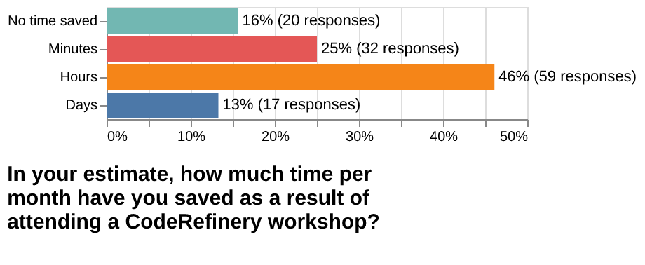

# Abstract

This report summarizes the achievements, feedback, and lessons learned during
the phase 3 of the CodeRefinery project (March 2022 -- February 2025).

# Project partners and budget

The project operated with a budget of 38 person-months (PM) per year for 3
years (March 2022 -- February 2025), with contributions from the following 8
funding partners:

- [Nordic e-Infrastructure Collaboration (NeIC)](https://neic.no): 11 PM/year for project management, workshop coordination, and community management.

- [Aalto University, Finland](https://scicomp.aalto.fi/about/science-it/): 6
  PM/year for lesson development, instructing, helping, outreach, streaming
  and recording, and transition to online teaching at scale.

- [Center for Humanities Computing (CHC/DeiC), Denmark](https://chc.au.dk): 2
  PM/year for instructing, helping, and outreach.
  The [Danish e-Infrastructure Consortium (DeiC)](https://www.deic.dk) operated  the [CodeRefinery GitLab service](https://coderefinery.org/repository/).

- [CSC -- IT Center for Science, Finland](https://www.csc.fi): 3 PM/year for
  lesson development, instructing, helping, and outreach. CSC provided the
  training coordinator and later the community manager (funded by NeIC).

- [EuroCC National Competence Center Sweden (ENCCS)](https://enccs.se): 2
  PM/year for co-organizing events which were either led by ENCCS or
  CodeRefinery or Aalto Science-IT or PDC Stockholm, on Python, containers,
  GPU programming, and build tools.

- [Norwegian Research Infrastructure Services (NRIS)/Sigma2, Norway](https://www.sigma2.no): 6 PM/year for lesson
  development, instructing, helping, and outreach. NRIS/Sigma2 provided the
  project manager (funded by NeIC).

- [USIT/University of Oslo, Norway](https://www.usit.uio.no/): 2 PM/year for
  lesson development, instructing, helping, and outreach.

- [National Academic Infrastructure for Supercomputing in Sweden
  (NAISS)](https://www.naiss.se/): 6 PM/year.
  NAISS and has supported CodeRefinery by providing
  teachers and helpers for CodeRefinery events as part of NAISS training.
  Staff based in Sweden has over the years contributed to lesson development,
  teaching, and hosting of individual events, on-site as well as online.

# Project goals

## Background and motivation

CodeRefinery is a **community-driven initiative designed to empower students, researchers, staff, and research software engineers** with the skills and tools needed to develop high-quality, efficient, reusable, and reproducible research software. By focusing on practical training in areas such as version control, documentation, testing, sharing, and reproducible workflows, we bridge the gap between research and software engineering. Our mission is to foster collaboration, improve research output, and promote open-source principles across academic disciplines. Open science is an important goal for universities and research institutions, and CodeRefinery is a key component in working towards this goal.

Since its beginning in 2016, CodeRefinery has contributed to enhancing the software development capabilities of the academic community in the Nordics and beyond. Over the past eight years, we have developed a comprehensive, openly maintained curriculum of lessons and courses that has been taught at over 40 workshops. **We reach circa 500 learners each year at all career stages and across all disciplines** and with a diverse range of programming expertise. We achieve this with the help of around 30 instructors, organizers, and facilitators.

CodeRefinery has cultivated a vibrant, collaborative community of instructors, learners, helpers, and partner organizations. Together, **we have built a robust cross-border training network** and a foundation for long-term improvements in research software development.

## Project objectives

The following objectives were set for the phase 3 of the project:

- Organize and deliver workshops and training events (online and in-person)
- Instructor training and development
- Develop and maintain a lesson portfolio
- Build a community and network of instructors and volunteer helpers
- Operate and support a GitLab service for Nordic research software
- Support the community of Nordic research software engineers
- Develop a governance model for CodeRefinery as a community-driven
  organization
- Develop a business model for a sustainable development and delivery of
  training events

We will summarize our achievements and lessons learned in the results section.

The following project objectives were not achieved:

- Establishing CodeRefinery as an independent organization:
  Instead the steering group and the project team favored to continue the
  project using the in-kind funding model, without creating a separate legal
  entity.
- Supporting the Carpentries organization by paying a membership fee and
  by providing a focal point for Nordic Carpentries activities: We didn't
  have the necessary budget to fund a Carpentries training coordinator and
  the membership fee. The project manager did not have the administrative
  bandwidth to follow-up and coordinate Carpentries instructor training for
  the Nordic region.

## Related documents and resources

For more information about the history of the project, the project proposal, and the project plan, we refer to the following documents:

- [History of the project](https://coderefinery.org/about/history/)
- [Proposal to the NeIC open call 2021 (phase 3 proposal)](https://coderefinery.org/about/reports/open-call-2021-proposal.pdf)
- [NeIC open call 2021 evaluation report](https://coderefinery.org/about/reports/open-call-2021-evaluation.pdf)
- [Collaboration agreement (phase 3)](https://coderefinery.org/about/reports/phase-3-collaboration-agreement.pdf)
- [Project proposal (phase 4)](https://github.com/coderefinery/reports-and-proposals/blob/main/phase-4-proposal/coderefinery-phase4-proposal.pdf) (submitted 2025-01-23)

# Results

## Training events

Our past events and participation statistics are summarized on the web:

- <https://coderefinery.org/workshops/>
- <https://coderefinery.org/about/statistics/>

During this phase of the project we have delivered:

- 6 online CodeRefinery tools workshops to over 2000 registered participants.
  These workshops consist of 6 half-days of training, 2 on-boarding days, and
  sometimes also 2 bring-your-own-code sessions. These events involve 5-10
  instructors, helpers, and exercise leads.
- 5 in-person CodeRefinery tools workshops (3 days).
- 1 instructor training event (online; 4 sessions over 4 weeks).
- 3 online Python for Scientific Computing workshops (3-4 half-days each).
- 1 Build Systems Course (online; 4 half-days).
- Tuesday Tools & Techniques for High Performance Computing (online; 4
  sessions over 4 weeks).

Most of our events have the size and planning effort of a small conference.

To be able to deploy so many events and reach so many participants and
contributors we have worked on the following improvements:

- Simplified the registration process.
- Simplified the naming of different roles and responsibilities in order to
  make it easier for new people to join the community and have a common
  understanding.
- Created a process for participants to send in a short report after the
  workshop to make it easier for us to hand out participation certificates.
- Collect feedback after each workshop day and publish it as part of the
  event.
- Use collaborative notes for questions and answers during the workshop and
  publish these as part of the event.
- "Bring your own classroom" concept to make it easier for organizations to
  join the workshop with their own participants.
- "Bring your own code" sessions to discuss and work on participants' own
  projects.
- Most workshops are streamed and recorded and we are typically able to
  publish recordings within the same day.
- Most of our workshops use co-teaching to improve the quality and the
  on-boarding experience for new instructors.

## Post-workshop survey results

In early 2024 we sent out a survey to participants of our workshops from 2022
and 2023.  We received 129 responses and this blog post summarizes the
findings.

The survey results with all details and additional questions have been
summarized in a blog post:
<https://coderefinery.org/blog/2024/08/10/post-workshop-survey/>

You can also browse the
[survey questions](https://github.com/coderefinery/2024-post-workshop-survey/blob/main/form.pdf)
and the
[Jupyter notebook](https://github.com/coderefinery/2024-post-workshop-survey) which generated the plots.
We have archived the results [on Zenodo](https://doi.org/10.5281/zenodo.13292363).

## Lesson material and video recordings

The project has developed and is maintaining and updating a broad curriculum
of lessons and manuals.

### Standard lessons

These are the lessons which are included in the "standard" CodeRefinery
workshop, and what we believe that every computational scientist (even those
with very small amounts of computation) should know.

- Version control with **focus on collaboration** and **not only for the command line**:
    - [Introduction to version control](https://coderefinery.github.io/git-intro/) (day 1-2):
      **Why we want to track versions and how to go back in time to a working version.**
      This lesson brings you from zero to using Git and GitHub for own projects.

    - [Collaborative distributed version control](https://coderefinery.github.io/git-collaborative/) (day 3):
      This lesson builds on "Introduction to version control" and we apply branching and learn about pull requests
      (merge requests), forks, and collaboration using Git and GitHub.

- [Reproducible research](https://coderefinery.github.io/reproducible-research/) (day 4):
  **Preparing code to be usable by you and others in the future.**
  We focus here on 3 aspects of reproducible programs and computations: documenting dependencies,
  environments, and computational steps in a reproducible way. We touch on containers.

- [Social coding and open software](https://coderefinery.github.io/social-coding/) (day 4):
  **What can you do to get credit for your code and to allow reuse.**
  We motivate and give an overview over software and data licensing and software citation best practices.

- [How to document your research software](https://coderefinery.github.io/documentation/) (day 5):
  Here we give an overview of the different ways how a code project can be documented: from small projects to larger projects.
  Markdown and Sphinx are central tools in this lesson.

- [Jupyter notebooks](https://coderefinery.github.io/jupyter/) (day 5):
  **A tool to write and share executable notebooks and data visualization.**
  This lesson gives an overview of what Jupyter notebooks are, when they can be
  particularly useful, and shows best practices for reusable and reproducible
  notebooks.

- [Automated testing](https://coderefinery.github.io/testing/) (day 6):
  **Preventing yourself and others from breaking your functioning code.**
  In this lesson we talk about motivation for testing, about test design, but
  also about some tools that are typically used for automated testing of
  software.

- [Modular code development type-along](https://coderefinery.github.io/modular-type-along/) (day 6):
  **Making reusing parts of your code easier.**
  The focus of this lesson is how to partition and organize projects as they
  grow from one screen-full to larger and how to make code portions reusable
  across projects and across notebooks.

### Shorter formats

- [Reproducible research software development using Python (using ML example)](https://coderefinery.github.io/reproducible-python-ml/):
  3-days format tailored for people who write Python code for machine learning.
- [Python Progression: Moving Beyond the Basics](https://coderefinery.github.io/python-progression/):
  This aims to be a "best of" from
  [Python for Scientific Computing](https://aaltoscicomp.github.io/python-for-scicomp/),
  distilled into a two half-day workshop.
- [Reproducible research software development using Python](https://coderefinery.github.io/reproducible-python/):
  2.5 days format tailored for people who write Python code.
- [CodeRefinery "mini-workshop"](https://coderefinery.github.io/mini-workshop/):
  Three sessions, each 1.5 - 2 hours long. Making an image processing pipeline
  reproducible, reusable, and extensible. Uses Python in examples.
- ["CodeRefinery in one hour"](https://coderefinery.github.io/research-software-engineering/):
  If you want to get an impression of the topics discussed in this workshop,
  check out the materials of the CodeRefinery in one hour workshop
  ([slides](https://zenodo.org/records/8242055)
  and
  [exercises](https://coderefinery.github.io/research-software-engineering/)).

### Video recordings

A number of video recordings of CodeRefinery lessons and workshops and
[Research Software Hour](https://researchsoftwarehour.github.io/) sessions can be
found on our [YouTube
channel](https://www.youtube.com/channel/UC47aupE7HKGduAjXKt1Gwrg/videos).

### Installation guides

- [Installation instructions](https://coderefinery.github.io/installation/) (see your workshop page for which ones are actually needed for you)

### Instructor training and manuals

- [Train the trainer workshop](https://coderefinery.github.io/train-the-trainer/):
  Do you teach the use of computers and computational tools? Are you curious
  about scaling your training and learn about tested and proven practices from
  CodeRefinery workshops and other trainers?  Four self-contained sessions on
  tools and techniques for computational training offer a great chance to enhance
  your teaching skills and learn about new tools and practices. What you will
  learn is also used a lot outside CodeRefinery, whenever good beginner friendly
  training is needed.

- [CodeRefinery manuals, our guides and hints on running CodeRefinery](https://coderefinery.github.io/manuals/):
  As the project and community grows, documentation becomes more important and
  this is our place where we document our guides and methods and solutions.

### Special topics

- [Tuesday Tools & Techniques for High Performance Computing](https://scicomp.aalto.fi/training/scip/ttt4hpc-2024/):
  this is a series of four self-contained episodes on best practices in high performance computing
  and a great chance to enhance your computational skills:
  - [HPC Resources: RAM, CPUs/GPUs, I/O](https://coderefinery.github.io/TTT4HPC_resource_management/)
  - [Day-to-day working on clusters](https://coderefinery.github.io/TTT4HPC_Interactive/)
  - [Containers on clusters](https://coderefinery.github.io/hpc-containers/)
  - [Parallelization and workflows](https://coderefinery.github.io/TTT4HPC_parallel_workflows/)

- [Collaborating and sharing using GitHub without command line](https://coderefinery.github.io/github-without-command-line/):
  In this lesson we try to introduce concepts around GitHub collaboration
  without using the command line at all, only using the web interface or GitHub
  desktop. This lesson has been picked up and developed further by others and
  is now part of the [Carpentries Incubator](https://github.com/carpentries-incubator/proposals/issues/166).

- [Data visualization using Python](https://coderefinery.github.io/data-visualization-python/):
  This material can be a useful and pragmatic starting point for somebody who
  starts with Python and wants to get up to speed with data visualization.
  Exercises are mostly using [Vega-Altair](https://altair-viz.github.io/)
  but also other libraries are mentioned.

- [CMake workshop (based on ENCCS version)](https://coderefinery.github.io/cmake-workshop/):
  This material can give a useful starting point into CMake. It contains
  exercises and was taught as part of a hackathon focused on porting codes to
  CMake.

- [Modular code development](http://cicero.xyz/v3/remark/0.14.0/github.com/coderefinery/modular-code-development/master/talk.md):
  This is an older version of the modular code development lesson based on
  slides and group work. This can work if the learners prefer discussions and
  presentation instead of demo and discussion.

- [Git branch design](https://coderefinery.github.io/git-branch-design/):
  Unfortunately we don't teach this lesson very often but it contains probably
  useful content about how to organize branches in a project. It also contains
  a discussion and exercises about rebasing which is compared to merging.

- [Mixed Martial Arts: Interfacing Fortran, C, C++, and Python](https://coderefinery.github.io/mma/):
  We haven't taught this lesson in a while so it will need some updates but it
  can be a useful starting point when developing material for mixed-language
  development and interfacing programs written in different languages.

### Derivative materials and programs

Derivative work based on our material is collected on
[this webpage](https://coderefinery.org/lessons/reusing/).

## Community management

The CodeRefinery project is more than a set of lessons, repositories, and
workshops. It is a community which reached a size where it needs active
management. It was important for the project to employ a dedicated community
manager in the second half of the project phase.

Below we highlight some of the activities and achievements in the context of
community management and engagement:

- We have put more emphasis on improving the on-boarding process for new
  instructors and helpers: Through better prepared meetings, through co-teaching, train-the-trainer workshops, and with the help of [operational manuals](https://coderefinery.github.io/manuals/).
- We held two in-person team meetings: A kick-off event in Espoo in 2022 and a
  writing retreat in Tromsø in 2024.
- We have celebrated 8 years of the project with a [blog post](https://coderefinery.org/blog/2024/09/19/celebrating-8-years/).
- We hold weekly calls with the project team.
- In order to make it easier for team members and volunteers to contribute to
  the project and get an overview of available tasks and open issues, we
  have a [task and roadmap page](https://coderefinery.org/tasks/) as well as
  a [project board](https://github.com/orgs/coderefinery/projects/7).

We are well connected with other projects and communities with a similar
scope:

- [OLS](https://we-are-ols.org/)
- [Digital Research Academy (DRA)](https://digital-research.academy/)
- [INTERSECT](https://intersect-training.org/)
- [The Carpentries](https://carpentries.org/)
- [UNIVERSE-HPC](https://www.universe-hpc.ac.uk/)
- [Suresoft](https://www.tu-braunschweig.de/suresoft)
- [EVERSE](https://everse.software/)

A number of CodeRefinery members are involved in [Nordic research software
engineers (RSE)](https://nordic-rse.org/) organization and we have helped
organizing a couple of events:

- [Nordic-RSE conference 2024](https://nordic-rse.org/blog/nrse-conference/)
- [Finnish RSE meetup](https://nordic-rse.org/blog/first-finnish-rse-meetup/)
- Nordic-RSE unconference 2023
- Nordic-RSE unconference 2022

## Ambassador program

In 2024 we started the [CodeRefinery ambassador
program](https://coderefinery.org/join/individuals/#coderefinery-ambassador)
as a way to engage and support people that like the project but do not have
the resources or background knowledge to support the project as a partner,
co-instructor or helper.  Since the start of the program in 2024 we held 5
ambassador calls with 5-15 participants each to get to know each other, share
updates about the project and discuss open questions and ideas.

To date, 26 people have signed up for the ambassador e-mail list.  Ambassadors
are from different organizations and backgrounds from all over Europe.  We got
great feedback and were able to provide support where needed; e.g.  shared
stickers for on-site workshops, provided a short slide summary of the project,
and event posters to print and distribute at the ambassadors organizations.

## Social media, newsletters, and chat

During phase 3 we have added further channels to our outreach activities:

- LinkedIn: <https://www.linkedin.com/company/coderefinery-research-software-development/> (372 followers)
- Mastodon: <https://fosstodon.org/@coderefinery> (316 followers)
- BlueSky: <https://bsky.app/profile/coderefinery.org> (76 followers)

Summary of number of followers/subscribers to our newsletters and chat:

- Newsletter: 193
- Chat digest: 26
- Ambassadors: 26
- Zulip chat: 499

In February 2025 we discontinued posting on Twitter (820 followers).

## Open House events

Towards the end of phase 3, we have restarted to provide CodeRefinery Open
House events, a concept we have experimented with during phase 2 of the
project.

The two recent events had the following focus:

- Open House focusing on week 2 of our 2-week workshops.
- Open House focusing on advanced version control ("Git masterclass"; see
  [blog post](https://coderefinery.org/blog/open-house-git-masterclass/)).

## Steering group and stakeholder engagement

During phase 3 of the project we have
held 12 steering group meetings (4 meetings per year).

The meeting minutes are [publicly available](https://drive.google.com/drive/folders/1wD_fzR94sTcqy-o8Rc1Qbl_l0HUFauHt).

## Governance and sustainability

We worked out a **governance charter**
([draft](https://github.com/coderefinery/governance-charter) to be approved)
for the project to define the roles and responsibilities of different actors
involved in the project. The goal is to increase flexibility and lower the
barrier for new partners.

## Blog posts

We have published a number of blog posts during phase 3. We believe that blog
posts are a good way to communicate with the community and to document our
activities. We use them as "organizational memory".

Here is a list of blog posts published during phase 3:

- [CodeRefinery Open House - advanced git / git masterclass](http://coderefinery.org/blog/open-house-git-masterclass/) (2025-01-31): Report from our open house session on advanced git / git masterclass on 14.01.25.
- [CodeRefinery - Celebrating eight years](http://coderefinery.org/blog/2024/09/19/celebrating-8-years/) (2024-09-19): Continuing eight years of collaboratively teaching good enough research software engineering practices.
- [CodeRefinery train the trainer workshop](http://coderefinery.org/blog/train-the-trainer/) (2024-09-09): Report and insights gathered during our train the trainer workshop in August/September 2024.
- [Bring your own classroom to a CodeRefinery workshop](http://coderefinery.org/blog/bring-your-own-classroom/) (2024-08-19): Join a CodeRefinery workshop with your own classroom and help us scale.
- [Results from our 2024 post workshop survey](http://coderefinery.org/blog/2024/08/10/post-workshop-survey/) (2024-08-10): In this blog post we summarize the feedback and suggestions collected from participants of workshops from 2022 and 2023.
- [Citation Information for Open Source Lessons](http://coderefinery.org/blog/2024/07/30/lesson-cffs/) (2024-07-30): Discussing the current state and potential future applications of the Citation File Format for lessons.
- [Summary of business and financing models -planning session Tromsø 2024](http://coderefinery.org/blog/2024/06/17/finance-models/) (2024-06-17): Discussing possible business and financing models for CodeRefinery.
- [Why should your organization support CodeRefinery and how?](http://coderefinery.org/blog/2024/06/07/organisation-info-support-cr-how/) (2024-06-07): Organizations can support the CodeRefinery project in several ways to make it sustainable and can have a mutually advantageous collaboration.
- [In-person meeting summary: Community](http://coderefinery.org/blog/2024/04/10/writing-retreat-community.md/) (2024-04-20): What is the CodeRefinery community to you?.
- [In-person meeting summary: Onboarding](http://coderefinery.org/blog/2024/04/10/writing-retreat-onboarding.md/) (2024-04-20): Onboarding new people to the community.
- [Drafting a governance structure for 2025 and beyond](http://coderefinery.org/blog/2024/04/19/drafting-a-governance/) (2024-04-19): We are working on defining a mission, vision, guiding principles, and a decision body for CodeRefinery in 2025 and beyond. This is an early draft.
- [We have completely changed our Git lessons. Hopefully to the better.](http://coderefinery.org/blog/2024/04/19/git-lesson-rewrite/) (2024-04-19): We don't start on the command line anymore. Instead, we start in the web interface of a Git hosting service and offer several tracks to follow the lesson.
- [The Modular Code Developement Lesson](http://coderefinery.org/blog/2024/04/19/in-person-modular-code-development-lesson/) (2024-04-19)
- [CodeRefinery Social Media Strategy](http://coderefinery.org/blog/2024/04/19/in-person-social-media-strategy/) (2024-04-19)
- [Asynchronous vs. Live Online Teaching: Understanding the Pros and Cons](http://coderefinery.org/blog/2024/04/18/in-person-asynchronous-versus-live-online-teaching/) (2024-04-18)
- [In-person meeting: install instructions update](http://coderefinery.org/blog/2024/04/04/in-person-install-instructions-session/) (2024-04-04): We looked at the installation instructions for CodeRefinery workshops and tried to figure out how to improve them.
- [In-person meeting summary: video production](http://coderefinery.org/blog/2024/04/04/in-person-video-production-session.md/) (2024-04-04): The video production session provided a hands-on experience in what goes on behind the scenes. It wasn't that hard.
- [Help us do the next CodeRefinery workshop (2024 H2)](http://coderefinery.org/blog/2024/03/25/next-cr-workshop-help-needed/) (2024-03-25): Our workshop in 2024 March went well. But we need help if we want to do this again.
- [Anyone want a streaming training workshop?](http://coderefinery.org/blog/2024/03/17/streaming-training-workshop/) (2024-03-17): CodeRefinery's streaming setup is getting fairly professional. Anyone want to learn how to reproduce it?.
- [Recap of the first week of the spring 2024 workshop](http://coderefinery.org/blog/2024/03/15/week1-march-workshop-rework/) (2024-03-15): Looking back at week one of the CodeRefinery workshop and the big rework of the version control lessons.
- [Help us make usable IDE/git install instructions](http://coderefinery.org/blog/2024/02/29/install-instructions/) (2024-02-29): We want our workshops to be more usable than before, and that means aligning with best practices.
- [Workshop format](http://coderefinery.org/blog/workshop-plan/) (2024-02-27): Discussions on Workshop format and how it affects lesson development.
- [Summary from a brainstorming meeting about the project future](http://coderefinery.org/blog/2024/01/24/project-future-concept-board/) (2024-01-24): Screenshots and summary from our concept board.
- [Lessons learned from the September 2023 online workshop](http://coderefinery.org/blog/2023/12/05/lessons-learned-sep-2023/) (2023-12-05)
- [What we plan to improve for the September 2023 workshop](http://coderefinery.org/blog/2023/06/25/planning-sep-workshop/) (2023-06-25): We encourage the community to give us feedback on these ideas.
- [Lessons learned from the March 2023 online workshop](http://coderefinery.org/blog/2023/04/12/lessons-learned-mar-2023/) (2023-04-12)
- [CodeRefinery workshop, 21-23 and 28-30 March 2023](http://coderefinery.org/blog/2023/02/14/march-workshop/) (2023-02-14): Our March workshop is soon, and you can join alone, as a team, or as a volunteer.
- [Learner teams in courses](http://coderefinery.org/blog/2022/11/28/teams/) (2022-11-28): Teams can provide high-quality interaction even in large courses.
- [Livestreaming courses](http://coderefinery.org/blog/2022/11/14/livestreaming-courses/) (2022-11-14): Livestream courses have changed how we teach by allowing unprecedented scaling possibilities.
- [Lessons learned from the Sep 2022 online workshop](http://coderefinery.org/blog/2022/11/08/lessons-learned-Sep-2022/) (2022-11-08)
- [CodeRefinery Mastodon account](http://coderefinery.org/blog/2022/11/08/mastodon/) (2022-11-08): CodeRefinery has started a Mastodon social media account.
- [Video publishing supports more learning styles](http://coderefinery.org/blog/2022/11/21/video-publishing/) (2022-11-08): Publishing course videos supports more learning styles and doesn't have to affect privacy.
- [Reverse hybrid teaching](http://coderefinery.org/blog/2022/11/07/reverse-hybrid/) (2022-11-07): 'Reverse hybrid' is instructors remote, students local - possibly spread among different locations in small groups.
- [Co-teaching and scaling up](http://coderefinery.org/blog/2022/10/31/co-teaching/) (2022-10-31): Co-teaching replaces (forced?) learner interaction with natural interaction between co-instructors.
- [Parallel chat ("HackMD") and scaling teaching](http://coderefinery.org/blog/2022/10/24/parallel-chat/) (2022-10-24): Parallel chat via a text document enables interactively at scale when online teaching.
- [Python for Scientific Computing open for registration and collaborators](http://coderefinery.org/blog/2022/10/21/python-for-scicomp/) (2022-10-21)
- [CodeRefinery teaching strategies and the future of teaching](http://coderefinery.org/blog/2022/10/17/future-of-teaching/) (2022-10-17)
- [Outcomes from online hackathon about measuring the impact of CodeRefinery workshops](http://coderefinery.org/blog/2022/05/18/measuring-impact/) (2022-05-18)
- [Our plans to improve our workshop registration process](http://coderefinery.org/blog/2022/05/04/improving-workshop-registration/) (2022-05-04)

## Presentations and other contributions to conferences

**Zenodo community**

We added the [Zenodo CodeRefinery
community](https://zenodo.org/communities/coderefinery/).  This way,
presentation slides don't disappear, they can be cited, and you can find them
all in one place.

Everyone can submit their own presentations or derivative work to the
CodeRefinery community on Zenodo.  This community is not only for lessons but
also presentations and reports.

**2024**

- CarpentryConnect in Heidelberg, Germany in November 2024: [Poster](https://github.com/coderefinery/posters/blob/main/2024_CarpentryCon.pdf)
  and [lightning talk](https://github.com/coderefinery/presentations/blob/main/2024-CarpentryCon.pdf) on ["Teaching 'good enough' research software engineering skills"](https://doi.org/10.5281/zenodo.14739411) (Samantha Wittke)
- ["The CodeRefinery project for training in research software engineering"](https://cicero.xyz/v3/remark/0.14.0/github.com/coderefinery/presentations/main/2024-hpc-train-ecosystem-europe.md/)
  at [The HPC Training Ecosystem in Europe (Online)](https://enccs.se/news/2024/10/the-hpc-training-ecosystem-in-europe/),
  Oct 22, 2024 (Johan Hellsvik)
- [Bring your own classroom to a CodeRefinery workshop](https://zenodo.org/records/13625954) at RSECon in Newcastle, UK in September 2024 (Samantha Wittke).
- Participation in Panel discussion on "Towards adoption of FAIR4RS: equipping researchers with FAIR research software skills" at RSECon 2024 (Samantha Wittke)
- ["Practical software licensing"](https://zenodo.org/records/11554001) at [DataverseNO](https://dataverse.no/) webinar,
  Jun 10, 2024 (Radovan Bast)
- ["CodeRefinery - My pathway into Research Software Engineering"](https://zenodo.org/records/11204358)
  at RSEHPC/ISC24, Jun 10, 2024 (Samantha Wittke)
- ["Competence building, the CodeRefinery way"](https://zenodo.org/records/11317382)
  at the [NeIC 2024 conference](https://indico.neic.no/event/259/)
  in Tallinn, May 28, 2024 (Radovan Bast)
- [Presentation](https://cicero.xyz/v3/remark/0.14.0/github.com/coderefinery/presentations/main/2024-liu-org.md/)
  to the Open Science Group, Linköping University, May 7, 2024 (Johan Hellsvik)
- [SIGHPC Education Webinar CodeRefinery - collaboratively training the next generation of Research Software Engineers](https://sighpceducation.acm.org/events/code_refinery/),
  [presentation slides](https://zenodo.org/records/11065411),
  [recording](https://youtu.be/q4WXp89SSQI),
  Apr 25, 2024 (Samantha Wittke, Radovan Bast)

**2023**

- [Research Software Hour flashtalk](https://zenodo.org/records/10126375) at Supercomputing 23
  [BoF on Scientific Software and the People Who Make it Happen: Building Communities of Practice](https://betterscientificsoftware.github.io/swe-cse-bof/2023-11-sc23-bof/),
  Nov 14, 2023 (Radovan Bast) - [blogpost on the session](https://bssw.io/blog_posts/reflecting-on-our-community-the-sc23-bof-on-scientific-software-and-the-people-who-make-it-happen-building-communities-of-practice)
- CodeRefinery talk at RSECon23:
  ["Experiences from teaching basic RSE skills with CodeRefinery"](https://zenodo.org/records/8317155), Sep 05, 2023 (Samantha Wittke, Radovan Bast)
- [CodeRefinery flashtalk](https://cicero.xyz/v3/remark/0.14.0/github.com/coderefinery/presentations/main/2023-ISC-lightning_WS-challenges.md/)
  in BoF at ISC - Challenges in reverse hybrid teaching, May 23, 2023 (Matias Jääskeläinen)
- CodeRefinery flashtalk and participation in panel discussion Education in HPC: A Lifelong Effort,
  [EuroHPCSummit](https://www.eurohpcsummit.eu/), Mar 22, 2023 (Johan Hellsvik)
- ["CodeRefinery: What We Learned from Teaching Software Engineering Practices to Students and Researchers in Nordics and Beyond"](https://doi.org/10.6084/m9.figshare.22191292.v1))
  at SIAM Conference on Computational Science and Engineering 2023 (Radovan Bast)
- CodeRefinery short talk
  ["CodeRefinery - a hub for FAIR Software practices"](https://cicero.xyz/v3/remark/0.14.0/github.com/coderefinery/presentations/main/2023-derse.md/)
  at deRSE as part of the Teaching and Learning Research Software Engineering workshop, Feb 21, 2023 (Samantha Wittke)

**2022**

- ["About the CodeRefinery project"](https://doi.org/10.5446/60140) at the
  [EuSSI training bazaar](https://eussi.org/bazaar/) - Nov 21, 2022 (Matias Jääskeläinen)
- "CodeRefinery - a hub for FAIR Software practices" at
  [DeiC conference 2022](https://www.deic.dk/en/conference/2022/program-day-1) (Radovan Bast)

## Mentions of CodeRefinery in other publications

- I. A. Cosden, K. McHenry and D. S. Katz, "Research Software Engineers:
  Career Entry Points and Training Gaps," in Computing in Science &
  Engineering, vol. 24, no. 6, pp. 14-21, Nov.-Dec. 2022, doi:
  <https://doi.org/10.1109/MCSE.2023.3258630> or on arxiv; page 7.
- US Research Software Engineer Association, & IEEE Computer Society. (2023).
  Research Software Engineers: Creating a Career Path—and a Career. Zenodo.
  <https://doi.org/10.5281/zenodo.10073233>; page 19.
- Barker, M., Breitmoser, E., Broadbent, P., Chue Hong, N., Hettrick, S.,
  Lampaki, I., Quinn, A., & Taylor, R. (2024). Software and skills for
  research computing in the UK. Zenodo.
  <https://doi.org/10.5281/zenodo.10473186>; page 15.
- Goth F, Alves R, Braun M et al. Foundational Competencies and
  Responsibilities of a Research Software Engineer [version 1; peer review: 2
  approved]. F1000Research 2024, 13:1429
  (<https://doi.org/10.12688/f1000research.157778.1>).

## GitLab code repository hosting

The CodeRefinery GitLab service began during the project’s first funding
period (2016-2018) and was initially hosted by CSC (Finland). Although it has
limited usage, it is valued by its user base, who appreciate having a GitLab
instance where data remains in Europe (specifically Scandinavia) under a
non-profit/academic governance.

- Service: <https://source.coderefinery.org>
- Documentation: <https://coderefinery.org/repository/>

Usage statistics

- Number of users: 822
- Number of users active in the last year: 267
- Number of users active in the last 100 days: 135
- Number of projects: 1993
- Number of projects active in the last year: 193
- Number of projects active in the last 100 days: 106

We are in the process of migrating the project from being administrated by the
CodeRefinery project to being managed by the [Danish e-Infrastructure
Consortium (DeiC)](https://www.deic.dk).
